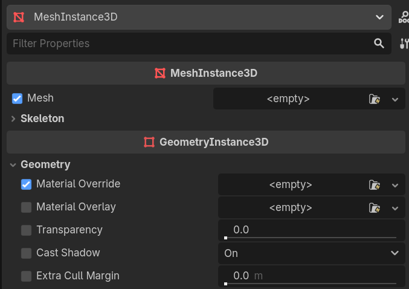
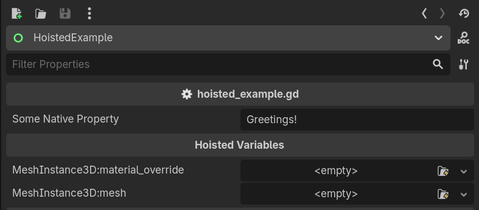

# Hoist

This repository contains an experimental Godot add on for "Hoisting" variables in the inspector.
This is intended as an augmentation for the "editable children" workflow, which allows you to access
your desired properties from the root of the instantiated scene, instead of digging into children/grand-children.

## Marking a Scene as Hoistable

To mark a node as containing hoisted properties, simply export Hoist. For example:

```gdscript
@export_category("Hoisted Variables")
@export var hoist : Hoist
```

This is usually something you would do at the 'root' script of a scene.

## Hoisting Variables [ui]

The first aspect of this library is a UI modification of the properties panel, which injects a checkbox
into the inspector, to the left of any hoistable properties. A property is considered hoistable if it
is a direct child or grand-child of a node which contains a hoist. In other words: It's opt-in.

When you hoist a variable, your choice will be saved, and next time you edit the scene root, this variable will appear there as well.

In this case, you're selecting that the 'Mesh' and 'Material Override' properties should be editable from the root of an instantiated scene, without needing to go spelunking through children/grand-children.

This allows you to control which properties you with to be editable, when authoring a scene.



## Editing the Hoisted Variables

When selecting a node which contains a `Hoist`, you will see all the hoisted variables. 

Changing a field here will change it in the child/grand-child node -it's equivalent to navigating to the field and changing it from there.



## A note on Editable Children...

Sadly, the 'editable children' checkbox does more than just render children in the Scene graph. It's also responsible for whether variables in the chidren are saved in the scene file at all.

Therefor it's neccesary for hoisted scenes to be marked as editable. This plugin handles that for you.

Nonetheless, the whole point of the plugin is that you hoist all of the properties that you care about. While using Hoist, you shouldn't need to actually *edit* the editable children.